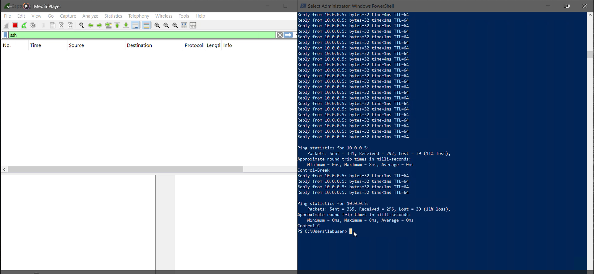

 

<h1>networkprotocols - Prerequisites and Installation</h1>
This is a quick tutorial demonstrating the uses of wireshark and how to analyze network traffic using different protocols within an VM

<h2>Video Demonstration</h2>

- ### [Youtube: Analyzing network traffic] (https://www.youtube.com)

<h2>Environments and Technologies used

- Microsoft Azure
- Remote Desktop Protocol
- DHCP
- SSH
- Wireshark
  
<h2>Operating Systems Used </h2>

<h2>List of Prerequisites</h2>

-Virtual Machines

-wireshark.exe

-Azure Account
  
<h2>High-Level Deployment and Installation</h2>

> [!Important]
> Each step will include written instructions and corresponding screenshots
Expand the See screenshots section to view the images

<h3>Step 1. Create Windows 10 VM</h3>
Log into the azure portal and click on virtual machines and select create new. I'm going to name the VM Windows10.

See screenshots

<h3>Step 2. Configure windows 10 vm for deployment</h3>
The resource group that i created is called RG-NetworkActivities. Both VM's will need to be in this resource group for the lab. 

See screenshots

Name the vm windowsvm and put it in East US 2 and I'm going to choose the windows 10 enterprise image 

See screenshots

Choose a username that's easy to remember for the lab or just make sure to open a notepad and save your credentials so you don't forget

See screenshots

Next we're going to go to the network tab and make a new vnet called lab1vnet

See screenshots

Now we're through with the configuration and we can continue to review & create

See screenshots

<h3>Step3.Create a linuxvm for deployment</h3>
Go to the virtual machine tab and click create new vm. We're going to use the same configuration as the windows10 vm with same resource group and virtual network.

See screenshots

For the authentication, I'm going to choose password instead of ssh key

See screenshots

Next make sure to choose the same vnet as the windowsvm and afterwards, we can review and create the linuxvm

See screenshots

See screenshots

<h3>Step4. Windows deployment</h3>
In order to rdp into the windowsvm i have to get the public ip address. Click on the windowsvm and the public ip address will be on the overview page.

See screenshots

After getting the public ip address, press win+r and type in mstsc to open the rdp connection tab. Enter your public ip address for the windows vm and the password and you'll be connected to the windows vm

See screenshots

See screenshots

See screenshots

See screenshots

<h3>Step5. Installing Wireshark</h3>
After connecting with your vm, you'll see some prompts from windows. You can say no to all of those prompts until you reach the GUI. After landing on the desktop, go to microsoft edge and type in wireshark. Once you land on the wireshark home page, choose the download button and depending on which architecture you're running, download the correct version.

See screenshots

See screenshots

See screenshots

See screenshots

See screenshots

See screenshots

See screenshots

See screenshots

See screenshots

See screenshots

See screenshots

See screenshots

See screenshots

<h3>Step6.Open Wireshark</h3>
After installation, go to the start button and type in wireshark to open. After it's open, choose the ethernet button and it'll take you to the network analyzer.

See screenshots

See screenshots

<h3>Step7. Analyzing network traffic using various protocols</h3>
After the network analyzer opens up, we can see a bunch of data currently shifting through the network. Even though the only thing I've done is just open wireshark, I can see my network is very active. So the first protocol to use is icmp which is short for ping. Head to the search bar above the network information and type icmp to filter the traffic to just icmp data.

See screenshots

See screenshots

After changing protocols, press the start button and open up powershell. From here I'm going to ping google.com and the linux vm that was created. type the following command ping www.google.com to see my vm attempt to establish a connection with google.com.

See screenshots

we can see the reply from google.com sending back to the client. That's a good sign because that shows a proper network connectivity between our client and google. Next is to ping the linux vm and check if we have a proper connection to the linux client. Go back to azure and get the private ip address and that's what will be used to attempt a connection with linux

See screenshots

See screenshots

I'm going to start up a continuous ping so I can see what happens when a firewall restriction is put in place while a perpetual ping is established. In order to start a perpetual ping, go back to powershell and type ping -t 10.0.0.5 and that'll initiate the continuous ping.

See screenshots

I'm going to set some firewall permissions to further see what happens in wireshark when a firewall is in place for a particular client. Go back into azure and click the linux vm. After it's selected, go to the network settings tab and scroll down to the network security group.

See screenshots

See screenshots

In order to set up the firewall, I'm going to click on create port rule and select inbound port rule.

See screenshots

On the add inbound security rule, go to the destination port ranges and type *. This is a stand in for any. Next is to select the protocol ICMPv4. Ping command uses the protocol to establish a connection with different servers and clients. Next, choose deny to block all incoming traffic from making a connection with the linux server. For the priority, I'm going to type in 290. So the reason for the number is the lower the number, the higher the priority and it'll take precedence over the SSH protocol in place.

See screenshots

After configuring this firewall, we can start to see the changes take effect immediately. Looking in the terminal, we can start to see the ping time out as the linux client can no longer reached. We can start to see a lot of request timed out messages and it'll continue in perpetuity until this rule is either deleted or the priority has been lowered.

Now we're going to delete the firewall rule and once that happens, we can see that communication to the client starts up rather quickly.

See screenshots

After analyzing firewall rules, I'm going to analyze ssh traffic. Clear the filter and type ssh in the search bar and restart the packet capture. Next go back into azure and get the private ip address to the linux vm. Copy down the ip address and go back into the windows vm and go back to powershell. To ssh into the linux vm
type ssh username@private-ipaddress. In my case, I'm going to enter ssh basheddaemon@10.0.0.6. You'll be prompted to enter your password and after that you'll be connected to the linux vm via a terminal. Enter a few commands to see how the traffic works in regards to ssh commands compared to when a ping is initiated.

See screenshots

See screenshots

